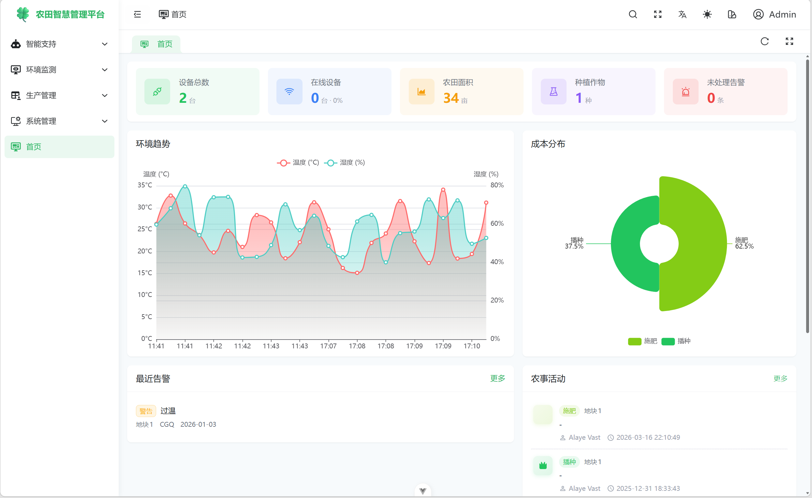
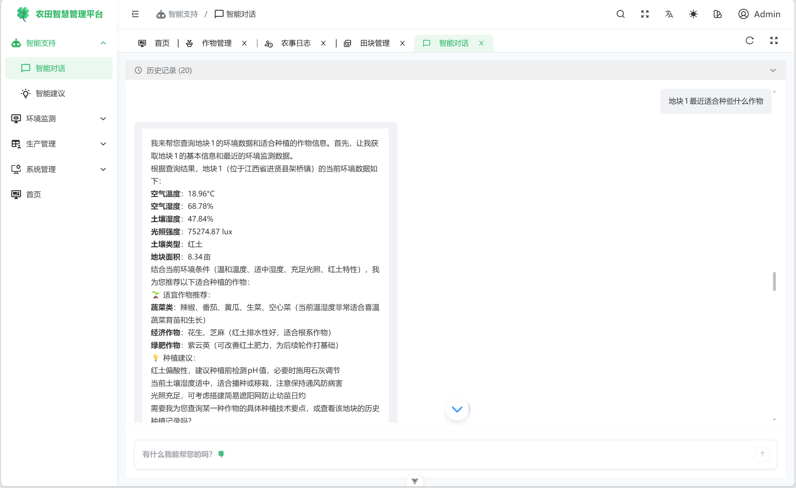
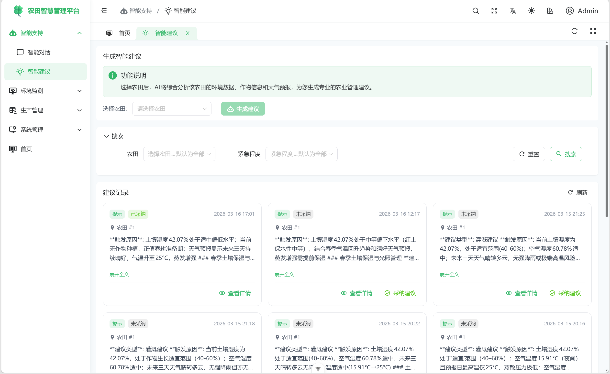
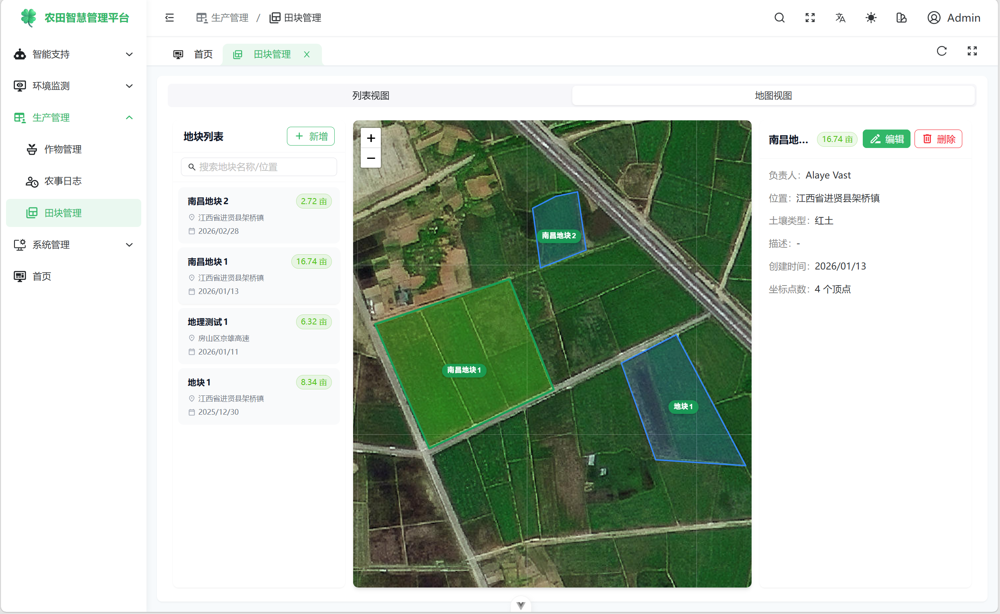
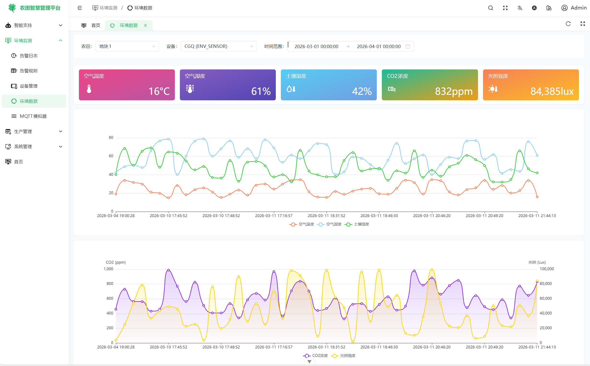

<div align="center">
	
	<h1>Aigri-Frontend</h1>
</div>

---

> [!NOTE]
> 🚧项目仍在建设中

## 简介

Aigri 是一个智慧农业管理平台。利用大模型、MCP 和 Function Calling 等技术构建专业的农业Agent，为用户提供高可信度的农业决策支持。基于最新的技术栈，前端包括 Vue3, Vite7, TypeScript, Pinia 和 UnoCSS。后端包括 SpringBoot3, Spring AI Alibaba。

## 架构

### 前端

- 基于 [`SoybeanAdmin`](https://github.com/soybeanjs/soybean-admin)，采用 Vue3, Vite7, TypeScript, Pinia 和 UnoCSS 等最新流行的技术栈。
- 集成 Element-Plus-X，实现AI对话界面。

### 后端

> [!TIP]
> 后端后续开源

- 采用 SpringBoot3, SaToken, MyBatisPlus, MySQL, Redis。
- 集成 Spring AI Alibaba

## 示例图片











## 使用

**环境准备**

确保你的环境满足以下要求：

- **git**: 你需要git来克隆和管理项目版本。
- **NodeJS**: >=20.19.0，推荐 20.19.0 或更高。
- **pnpm**: >= 10.5.0，推荐 10.5.0 或更高。

**克隆项目**

```bash
# github
git clone https://github.com/Alaye-Dong/aigri-frontend.git
```

**安装依赖**

```bash
pnpm i
```

> 由于本项目采用了 pnpm monorepo 的管理方式，因此请不要使用 npm 或 yarn 来安装依赖。

**启动项目**

```bash
pnpm dev
```

**构建项目**

```bash
pnpm build
```

## 致谢

- [SoybeanAdmin](https://github.com/soybeanjs/soybean-admin)
- [Ruoyi-Vue-Plus](https://github.com/dromara/RuoYi-Vue-Plus)
- [RuoYi-Vue-Plus-Single](https://gitee.com/ColorDreams/RuoYi-Vue-Plus-Single)
- [ruoyi-plus-soybean](https://github.com/m-xlsea/ruoyi-plus-soybean)
